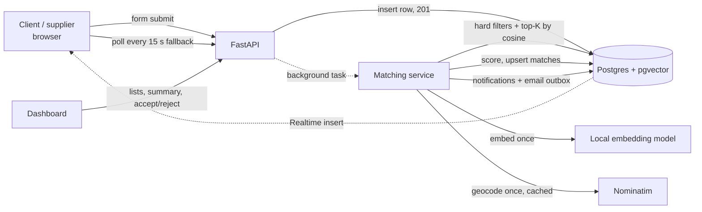

# Architecture

## Components

| Component | Responsibility |
|---|---|
| **Frontend** (React + Vite, `frontend/`) | Forms, portals, dashboard. Talks to the backend only through `src/api/client.js`. Its one direct Supabase use is the Realtime subscription for notifications. |
| **API** (FastAPI, `backend/app/api/`) | Thin routers: validate input (Pydantic), call services, shape responses. No business logic. |
| **Services** (`backend/app/services/`) | `matching` (pipeline), `scoring` (pure functions, no I/O), `embedding` (local model), `units`, `geo` (geocoding + distance), `notifications`, `email`. |
| **Database** (Postgres + pgvector, Supabase) | Tables, vector index, constraints. Schema lives in `supabase/migrations/*.sql`. |
| **Supabase Auth** | Email + password accounts. The frontend logs in with supabase-js and sends the access token; the backend asks Supabase who it belongs to (`app/auth.py`). |
| **Embedding model** | `BAAI/bge-small-en-v1.5` through `fastembed` (ONNX, CPU, ~70 MB), loaded once per process. |

Layering: routers → services → models. Only the matching service knows the pipeline order.

## Data flow

1. A form posts to `POST /api/requirements` or `/api/offerings`. The row is saved and the
   response (201) returns immediately.
2. A background task runs `match_requirement(id)` or `match_offering(id)`:
   embed the record (once), geocode its location (once, cached), then find candidates.
3. One SQL query applies every hard filter (category, unit family, quantity, lead time,
   budget, delivery radius via haversine) and returns the `RETRIEVE_K` nearest by cosine
   distance (`embedding <=> :vec`).
4. Candidates are scored in Python (`scoring.py`). The best `MAX_MATCHES_PER_ITEM` with
   score ≥ 60 are upserted on `(requirement_id, offering_id)`, never touching `status`.
5. Matches ≥ 70 flip `new → notified` in one conditional `UPDATE`. Only the run that wins that
   update creates the two notifications and two emails, so nobody is notified twice.
6. The browser gets new notifications through Supabase Realtime, or by polling.
7. Accept/reject: `PATCH /api/matches/{id}/status`, only by one of the two parties (else 403) and
   only from `new|notified` (else 409). Each decision retrains the ranker weights in the background
   (`services/ml.py`), and later match runs use them. Contact emails appear only to the parties of
   an accepted match.

## Scalability notes

- **Cost grows linearly with records, not pairs.** Each record is embedded exactly once at
  creation. Matching never embeds the other side again, and no pair is compared by the model.
- **Each match run is sublinear in table size.** B-tree-friendly hard filters cut candidates
  first, and the HNSW index (`vector_cosine_ops`) serves nearest-neighbour search. At large
  scale, enable `hnsw.iterative_scan` (pgvector ≥ 0.8) so filtered searches still return K rows.
- **Matching is a plain function** (`app.services.matching.match_requirement`) that opens its
  own session. Moving it from FastAPI `BackgroundTasks` to Celery/RQ/Arq means changing only
  the call site in `api/items.py`.
- **Stateless API.** All configuration comes from environment variables, so running several
  API processes behind a load balancer (or in containers later) needs no code changes. The
  Nominatim rate limiter is per process. Swap in a paid or self-hosted geocoder at volume.
- **Idempotent by construction.** The unique `(requirement_id, offering_id)` key and the
  conditional status flip make retries and re-runs (`POST /api/dev/rematch`) safe.
